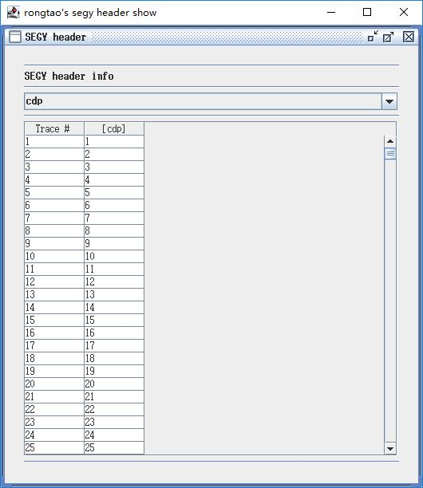

## the interface of the software



[Rong Tao](https://github.com/Rtoax)

- 👋 Hi, I’m [@rtoax](https://github.com/Rtoax), you can see me in [@linux-visor](https://github.com/linux-visor) too.
- 👀 I’m interested in [Linux](https://github.com/torvalds/linux)
- 🌱 I’m currently learning [Linux](https://github.com/torvalds/linux)
- 💞️ I’m looking to collaborate on [libcareplus](https://github.com/Rtoax/libcareplus), [test-linux](https://github.com/Rtoax/test-linux) and [more](https://github.com/Rtoax).
- 📫 How to reach me [GitHub](https://github.com/Rtoax), [CSDN](https://rtoax.blog.csdn.net/), [Gitee](https://gitee.com/rtoax) and 哆啦Linux梦.

* ```.su``` data header

```java
        String[] segy = {"tracl",   "tracr",   "fldr",    "tracf",   "ep",
                         "cdp",     "cdpt",    "trid",    "nvs",     "nhs",
                         "duse",    "offset",  "gelev",   "selev",   "sdepth",
                         "gdel",    "sdel",    "swdep",   "gwdep",   "scalel",
                         "scalco",  "sx",      "sy",      "gx",      "gy",
                         "counit",  "wevel",   "swevel",  "sut",     "gut",
                         "sstat",   "gstat",   "tstat",   "laga",    "lagb",
                         "delrt",   "muts",    "mute",    "ns",      "dt",
                         "gain",    "igc",     "igi",     "corr",    "sfs",
                         "sfe",     "slen",    "styp",    "stas",    "stae",
                         "tatyp",   "afilf",   "afils",   "nofilf",  "nofils",
                         "lcf",     "hcf",     "lcs",     "hcs",     "year",
                         "day",     "hour",    "minute",  "sec",     "timbas",
                         "trwf",    "grnors",  "grnofr",  "grnlof",  "gaps",
                         "otrav",   "d1",      "f1",      "d2",      "f2",
                         "ungpow",  "unscale", "ntr",     "mark",    "shortpad",
                         "line3d",  "cdp3d",
                         "unass0",  "unass1",  "unass2",  "unass3",  "unass4",
                         "unass5",  "unass6",  "unass7",  "unass8",  "unass9"};
```

* ```float``` convertion class

```java
class Swap{
        /* float */
        public static float swap (float value){
                int intValue = Float.floatToRawIntBits (value);
                intValue = swap (intValue);
                return Float.intBitsToFloat (intValue);
          }
        /* int */
        public static int swap (int value){
                int b1 = (value >>  0) & 0xff;
                int b2 = (value >>  8) & 0xff;
                int b3 = (value >> 16) & 0xff;
                int b4 = (value >> 24) & 0xff;
                return b1 << 24 | b2 << 16 | b3 << 8 | b4 << 0;
          }
        /* short */
        public static short swap (short value){
                int b1 = value & 0xff;
                int b2 = (value >> 8) & 0xff;
                return (short) (b1 << 8 | b2 << 0);
          }
        /* long */
        public static long swap (long value){
                long b1 = (value >>  0) & 0xff;
                long b2 = (value >>  8) & 0xff;
                long b3 = (value >> 16) & 0xff;
                long b4 = (value >> 24) & 0xff;
                long b5 = (value >> 32) & 0xff;
                long b6 = (value >> 40) & 0xff;
                long b7 = (value >> 48) & 0xff;
                long b8 = (value >> 56) & 0xff;
                return b1 << 56 | b2 << 48 | b3 << 40 | b4 << 32 |
                       b5 << 24 | b6 << 16 | b7 <<  8 | b8 <<  0;
          }
        /* double */
        public static double swap (double value){
                long longValue = Double.doubleToLongBits (value);
                longValue = swap (longValue);
                return Double.longBitsToDouble (longValue);
          }
        /* short array */
        public static void swap (short[] array){
                for (int i = 0; i < array.length; i++)
                        array[i] = swap (array[i]);
          }
        /* int array */
        public static void swap (int[] array){
                for (int i = 0; i < array.length; i++)
                        array[i] = swap (array[i]);
          }
        /* long array */
        public static void swap (long[] array){
                for (int i = 0; i < array.length; i++)
                        array[i] = swap (array[i]);
          }
        /* float array */
        public static void swap (float[] array){
                for (int i = 0; i < array.length; i++)
                        array[i] = swap (array[i]);
          }
        /* double array */
        public static void swap (double[] array){
                for (int i = 0; i < array.length; i++)
                        array[i] = swap (array[i]);
          }
}
```
